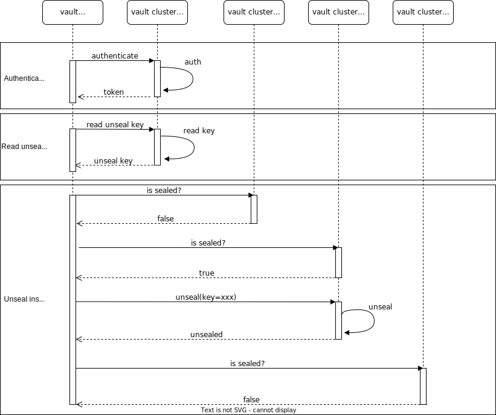

# vault-unsealer
[](https://goreportcard.com/report/github.com/soerenschneider/vault-unsealer)


Automatically unseals configured Vault instances using a push mechanism.

## Key Features

🔐 Retrieve Vault's unseal key from Vault's KV2 or transit secret engine

🛂 Authenticate against Vault using AppRole, (explicit) token or implicit__ auth

🔭 Robust automation through observability

## FAQ

**Q:** Why would I need auto-unsealing?

**A:** I'm trying to push OS-, container image- and Vault-updates itself rather aggressively, therefore I'm not patching any machines manually, but automatically (see [conditional-reboot](https://github.com/soerenschneider/conditional-reboot)). Hence, I need a mechanism that unseals preconfigured Vault instances automatically without human intervention.
<hr/>

**Q:** Ok, but why not using auto-unsealing using [AWS KMS](https://developer.hashicorp.com/vault/tutorials/auto-unseal/autounseal-aws-kms) / [Azure Key Vault](https://developer.hashicorp.com/vault/tutorials/auto-unseal/autounseal-azure-keyvault) / [GCP KMS](https://developer.hashicorp.com/vault/tutorials/auto-unseal/autounseal-gcp-kms)?

**A:** If your Vault clusters / instances do not run one of the specified cloud providers (like mine), you'll have to issue and deal with access keys to said platforms: distribute them secretly, keep them safe and rotate them frequently. Vault-unsealer [reads the unseal key from Vault itself](#how-does-it-work) (make sure it's well protected!) as I've written enough tooling that helps me keep my Vault credentials safe and rotate them both frequently and automatically (e.g. [vault-approle-cli](https://github.com/soerenschneider/scripts/blob/main/vault/vault-approle-cli.py) or [vault-mfa](https://github.com/soerenschneider/scripts/blob/main/vault/vault_mfa.py)).
<hr/>

**Q:** Why not using auto-unsealing using [Vault Transit](https://developer.hashicorp.com/vault/tutorials/auto-unseal/autounseal-transit)?

**A:** I did not want to manage another cluster / production instances of Hashicorp Vault even though I built some tooling around it that keeps maintenance low.
<hr/>

**Q:** Do only three real question justify an own FAQ section?

**A:** Probably not, but here we are.
<hr/>

## Installation

### Docker / Podman
````shell
$ git clone https://github.com/soerenschneider/vault-unsealer.git
$ cd vault-unsealer
$ docker run -v $(pwd)/contrib:/config ghcr.io/soerenschneider/vault-unsealer:main -conf /config/example-config.json
````

### Binaries
Head over to the [prebuilt binaries](https://github.com/soerenschneider/vault-unsealer/releases) and download the correct binary for your system.

### From Source
As a prerequesite, you need to have [Golang SDK](https://go.dev/dl/) installed. After that, you can install vault-unsealer from source by invoking:
```text
$ go install github.com/soerenschneider/vault-unsealer@latest
```

## Configuration
```json
{
  "clusters": [
    {
      "endpoints": [
        "https://vault.dd.soeren.cloud:8200",
        "https://vault.ez.soeren.cloud:8200",
        "https://vault.pt.soeren.cloud:8200"
      ],
      "cache_unseal_key": true,
      "check_interval_s": 60,
      "unseal_key_impl": "vault-transit",
      "unseal_key_config": {
        "vault_auth_type": "approle",
        "vault_auth_config": {
          "role_id": "yyy",
          "secret_id": "xxx",
          "approle_mount": "approle"
        },
        "vault_endpoint": "https://vault.ha.soeren.cloud",
        "vault_transit_mount_path": "transit_vault_unsealer",
        "vault_transit_key_name": "prod",
        "vault_transit_ciphertext": "cipher"
      }
    }
  ]
}
```

Use the example [systemd service file](contrib/vault-unsealer.service) to run it at boot.

## Observability

### Metrics

Metrics are available in the Prometheus format and can be collected using Prometheus / Victoriametrics or similar.


All metrics are prefixed with `vault_unsealer`. 

| Name                               | Type      | Labels                |
|------------------------------------|-----------|-----------------------|
| version                            | GaugeVec  | version, hash         |
| start_time_seconds                 | Gauge     |                       |
| key_retrieval_errors_total         | Counter   |                       |
| agent_last_check_timestamp_seconds | GaugeVec  | vault_instance        |
| agent_sealed_status_bool           | GaugeVec  | vault_instance        |
| unseal_errors_total                | GaugeVec  | error, vault_instance |

## How does it work?


## CHANGELOG
Check out the [changelog](CHANGELOG.md) here
